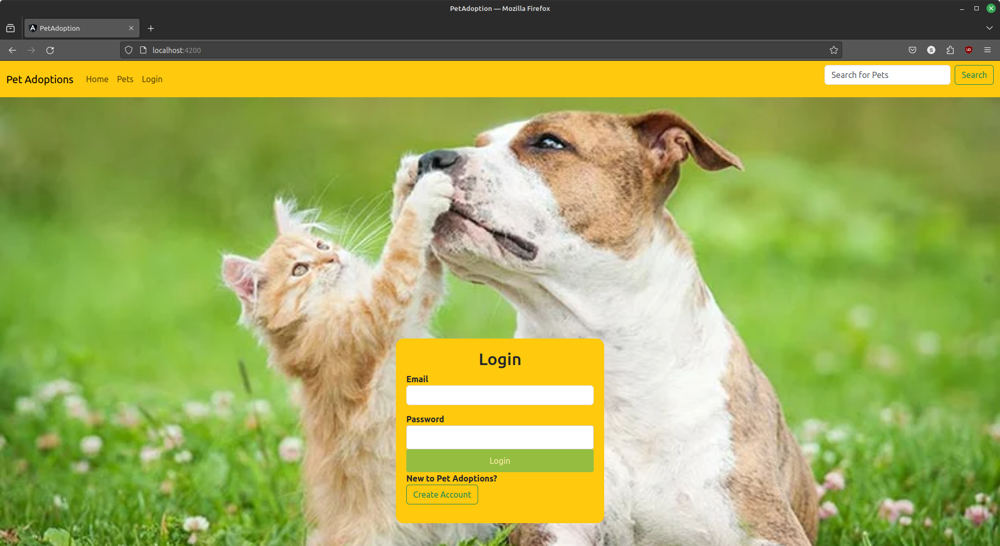
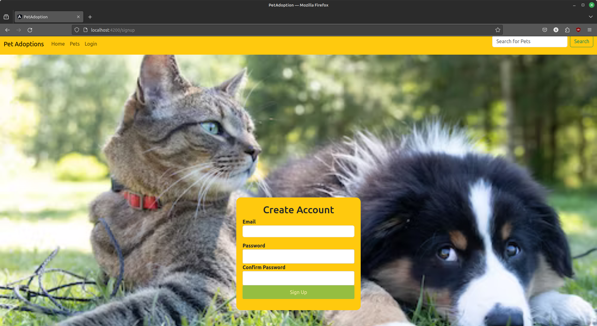
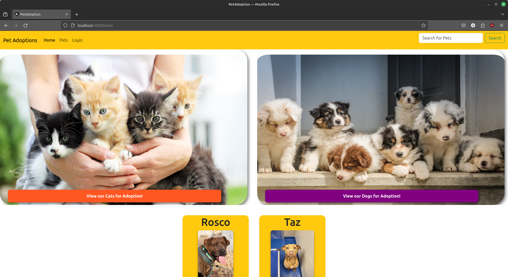
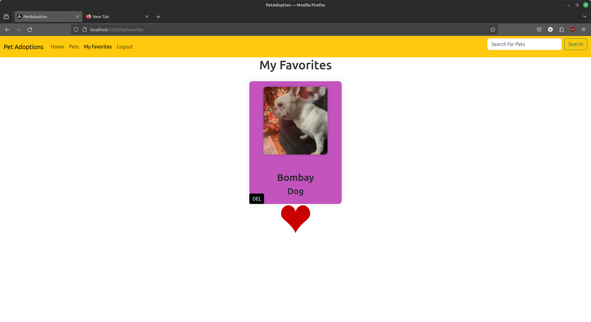
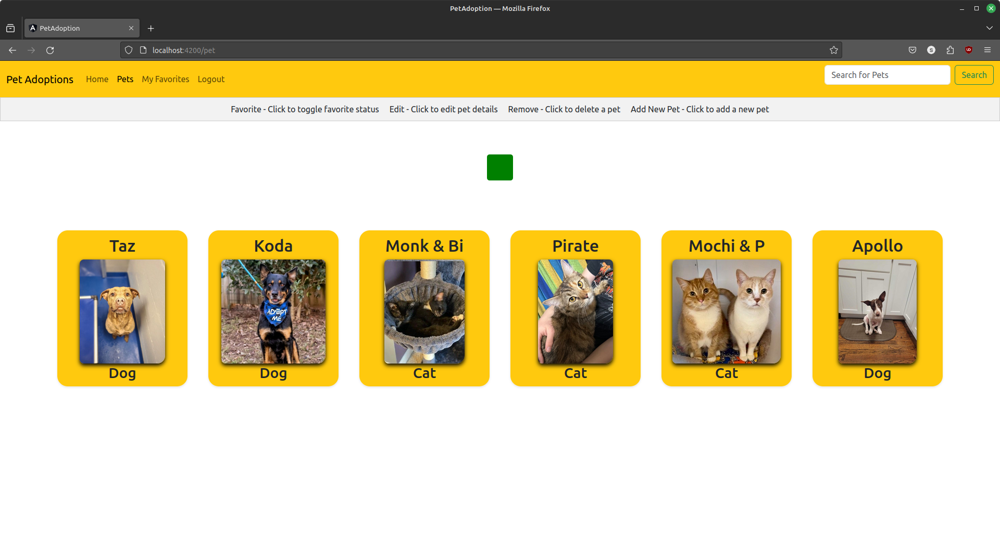
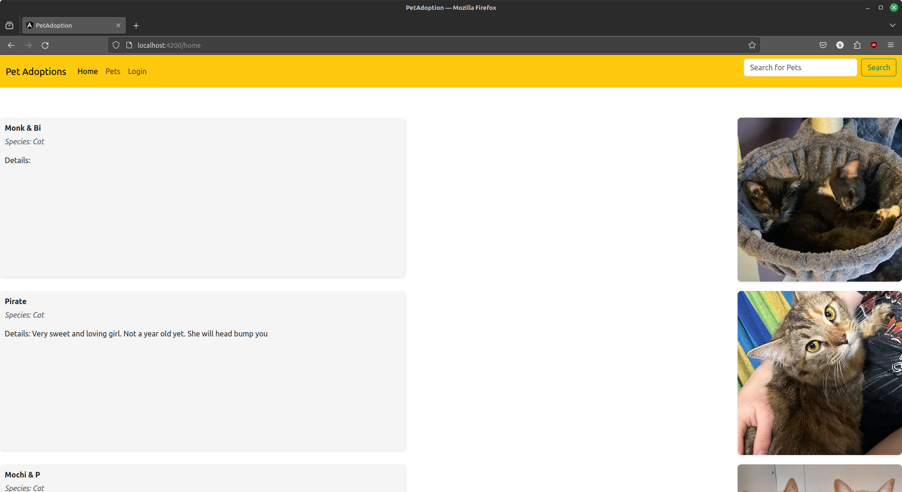
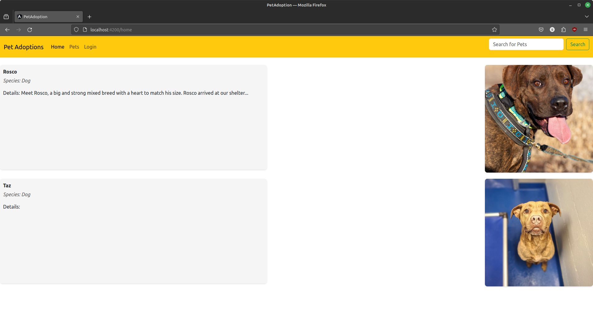

# PetAdoption

This project was generated with [Angular CLI](https://github.com/angular/angular-cli) version 16.2.10.

## Development server

Run `npm install` to install the required packages locally to run the server. 

Run `ng serve` for a dev server. Navigate to `http://localhost:4200/`. The application will automatically reload if you change any of the source files.

## Code scaffolding

Run `ng generate component component-name` to generate a new component. You can also use `ng generate directive|pipe|service|class|guard|interface|enum|module`.

## Build

Run `ng build` to build the project. The build artifacts will be stored in the `dist/` directory.

## Running unit tests

Run `ng test` to execute the unit tests via [Karma](https://karma-runner.github.io).

## Running end-to-end tests

Run `ng e2e` to execute the end-to-end tests via a platform of your choice. To use this command, you need to first add a package that implements end-to-end testing capabilities.

## Further help

To get more help on the Angular CLI use `ng help` or go check out the [Angular CLI Overview and Command Reference](https://angular.io/cli) page.

## A Pet Adoption Website that utilizes the [PetFinder API](https://www.petfinder.com/developers/)

#### Currently deployed at [Pet Adoption](https://petadoption-9abd7.web.app/)

- Please feel free to login and view current pets for adoption

#### Views

  The Login page will log you in.
  

  The Create Account page will create a new account so that a user can login and access the pets favorits page. It will validate that your passwords match and 
  are long enough.
  

  Home page is pulling from the Petfinder Api for pets displayed below the adoption links.
  

  The favorites page where users can keep pets they have favorited, the color changes as you hover over the card.
  

  Pets page displays pets available that have photos from the PetFinder API
  

  The cats page displays cats available for adoption.
  

  The dogs page displays dogs available for adoption.
  

  The pet details page displays the details from the Petfinder API of the pet selected.
  
